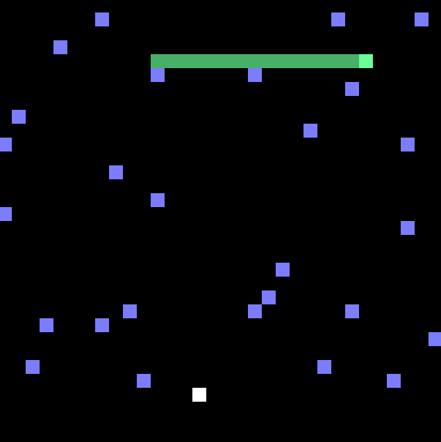

# Snake-Shot

A retro style game made in MIPS assembly language. Inspired by the 1980s centipede arcade game.

Shoot the snake 3 times to win and go to the next level.

You can also shoot the purple mushrooms or the red mushroom bombs that fall from the sky.

Don't get eaten, and don't get blown up!

Controls:
- Press 's' to start the game
- Press 'j' to move left
- Press 'k' to move right
- Press 'x' to shoot

